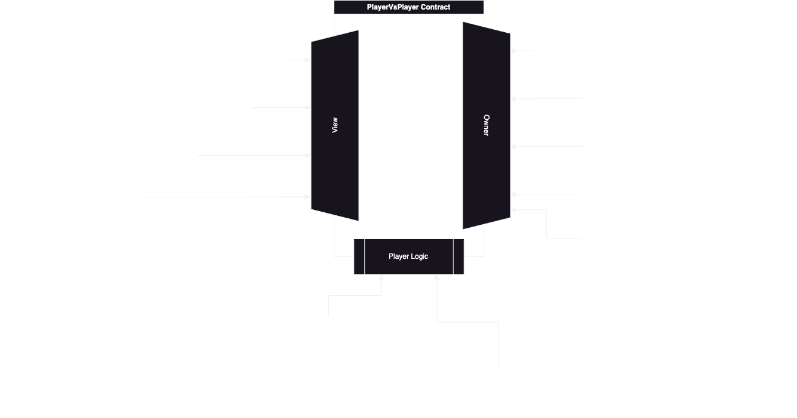

# PlayerVsPlayer Mindustry Mod

This is one out of three respositories: [PlayerVsPlayer Mindustry Server Plugin](https://github.com/0xPuddi/PlayerVsPlayer-Mindustry-Server-Plugin), [PlayerVsPlayer Mindustry Client Mod](https://github.com/0xPuddi/PlayerVsPlayer-Mindustry-Client-Mod) and PlayerVsPlayer Smart Contracts.

This project offers the possibility for players to connect on PvP Mindustry matches and to bet on them

[Metamask does not yet support ERC-681](https://github.com/MetaMask/metamask-mobile/issues/8308): Project development is paused.


## PlayerVsPlayer Smart Contract Documentation

Smart contract logic used for the betting system in the PlayerVsPlayer Mindustry Mod.

Be aware that the contract is not Auddited and we are not planning to audit it. We do not take responsibility of any funds losses by this code. See `LICENSE`.

The contract is schematized as follows:



The contract uses gameId and playerId to handle stat between the Mindustry server that uses the plugin and the blockchain. Those two values are obtained by hasing a player id and a gameid generated by the server using keccak256, thuis way the server can handle any player and match without any interruption.

I will give a brief explanation only the functions that permit the game logic: `BetGame`, `EndGame`, `GameFail`.

- `BetGame`

This function is external and non payable, it takes the gameId and the playerId to store the bet, which is placed with native tokens by using `msg.value`. It is gated by the `minBet` modifier, which ensures that the minimum bet is satisfied. A second bet by a player will be reverted as he has already placed his bet correctly and we do not take any bet change. As the function is usable by anyone with any value, we ensured that there is no risk of overriding any user balance if a bad actor started behaving maliciously, instead if he will bet on a random game he will probably lose his funds forever.
In the future we might support ERC20.

- `EndGame`

This function is gated by the `onlyOwner` modifier. Once the owner of the contract will deploy the contract he will be able to call this function with the winners, provided as an array of `bytes32` and the gameId as a `bytes32`, the contract will lookup the winners in the game, and if they are present it will distribute the initial bet and the rest, minus the protocol fee, of the game balance (the amount of all losers bets) and distribute them based on the percentage of the weight of all winners (in a pot of 10 eth with 2 winners with 1 eth bet each they will be rewarded the initial 1 eth and half of the remainings 8 eth of the pot).

- `GameFail`

This function is gated by the `onlyOwner` modifier. When a game fails to start and there are players thta have betted on it, the owner can decide to end the game and redestibute any player bets ny its entirety and reset the game.


Any auxiliary functions implemented to add any needed functionality, can be found by looking at the contract file: `./srcPlayerVsPlayer.sol`.

### Usage

> Clone the repo.

The build will be created into ./out, to build it:
```sh
make fbuild
```

To run tests into the ./test folder:
```sh
make ftest
```

To get coverafe of tests into the ./test folder:
```sh
make fcoverage
```

To deploy the contract:
```shell
make deploy RPC="your-rpc-url" KEY="your-private-key"
```

If you have an `.env` file with RPC and KEY variables set like in `.env.example` simply run:
```shell
make deploy
```
